프로젝트 설정
---------------------------
* [시작하기](#server) 
* [환경구분](#environments)  
* [민감정보 관리](#env)  
* [공통 메세지 관리](#systemMessage)  
* [Sequelize 객체](#models)  
* [DB 연결](#sync-database) 

server
---------------------------------

  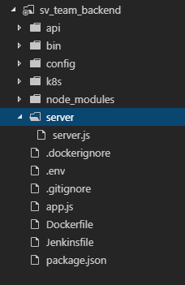  
  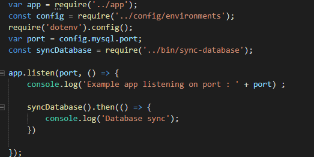  
 
  
 
1. Package.json에 npm start(서버실행명령어)를 실행하게 되면 위의 server.js가 실행된다.(Package.json에 세팅)  
2. server.js 코드를 보면 app.js 파일에서 node 서버를 구동하고 이후 syncDatabase()를 통해 db와 연결한다.
 
 

environments
---------------------------------
 

  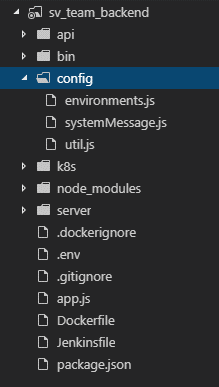  
  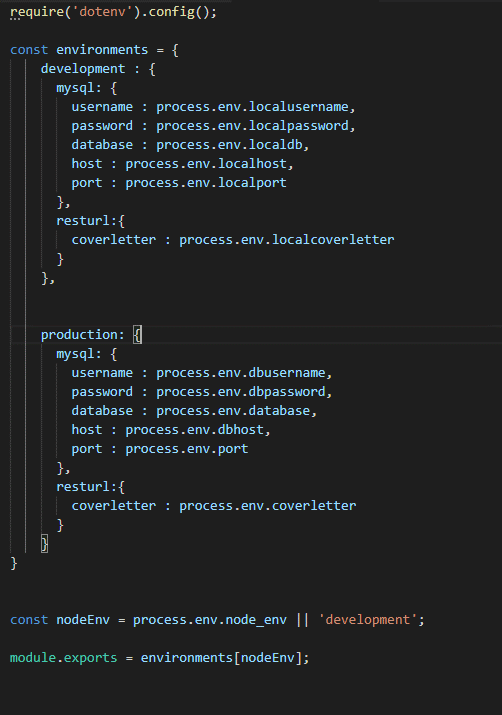  
 

 
1. 로컬 환경과 운영환경의 구분을 위하여 config 폴더내에 environments 파일을 정의하여 사용한다.  
2. .env파일에 서버 정보 등을 정의해놓고 environments.js파일에서 사용하여 local환경가 운영환경에서의 정보를 분리시킨다.
 
 
 
 env
 ---------------------------------
 

  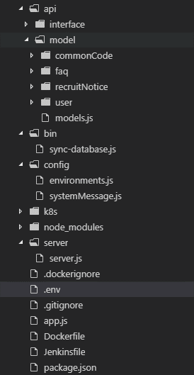  
  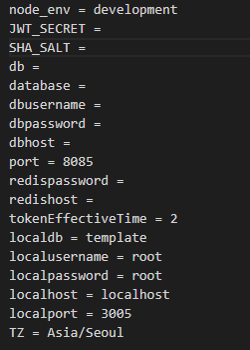  
 

 
 1. .env 파일내에 maria ,redis , jwt 관련 정보등을 정의하여 사용한다. Node_env 속성을 통하여 위에서 설명한 environmemts.js 파일내에서 로컬과 운영환경을 구분 할 수 있다.
 
 

systemMessage
---------------------------------
 

    
  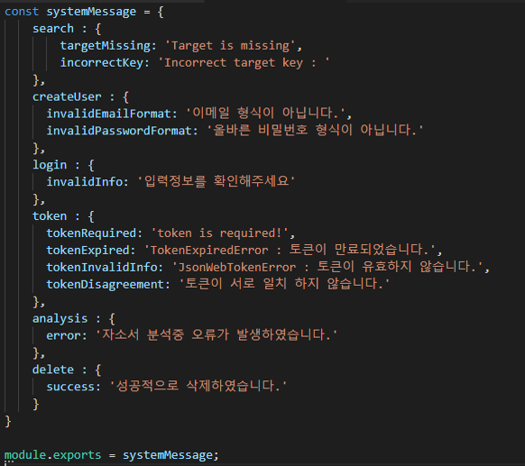  
 

 
 1. 공통으로 사용되는 메시지는 config 폴더안에 systemMessage 파일 내에 정의하여 사용한다.
 
 

models
---------------------------------
 

  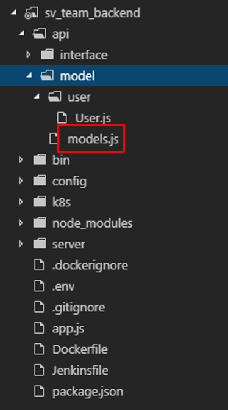  
  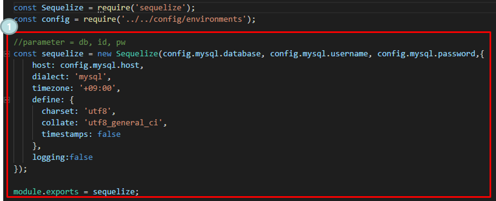  
 

 
 1. Node에서는 maria db와 통신하기 위해 편리한 기능을 제공하는데, 이때 사용되는것이 sequelize이다. Sequelize를 사용하기 위해서는 객체를 만들고 db정보를 통해 연결을 해야한다. 매번 객체를 만들어 db와 연결되는 model을 정의 할 수 없으니 models.js를 따로 만들어 db와 연결하고 필요시 import해서 사용한다.
 
 

sync-database
---------------------------------
  

  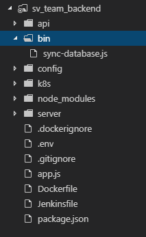  
  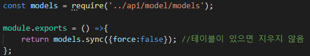  
 

 
 1. Sync-database.js 파일은 db와 연결하는 부분이다. Sequelize와 연결을 위해 생성한 model을 가져와 sync 함수를 통해 db연결을 실행한다. 이때 force:false 옵션을 주면 테이블이 존재할 경우 테이블을 지우지 않는다.
  
  
 
