개발:computer:
---------------------------
* [프로젝트 구조](#프로젝트-구조) 
* [API interface to index](#API-interface-to-index)  
* [API interface to controller](#API-interface-to-controller)  
* [API interface to model](#API-interface-to-model)  
* [API CommonUtil](#API-CommonUtil)  
* [API CommonCode](#API-CommonCode)  
* [토큰인증](#토큰인증)  

 

프로젝트 구조
---------------------------------
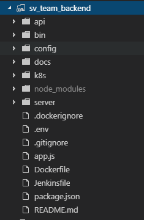

* `api` - Api 통신을 위한 data model과 data를 만들기 위한 controller가 정의합니다. 
* `bin` - 서버와 DB의 연결을 제어합니다.  
* `config` - 공통 메세지 및 각종 설정파일이 정의합니다.  
* `docs` - git의 프로젝트 소개 파일이 정의합니다.  
* `k8s` - k8s 설정관련 파일이 정의합니다.
* `node_modules` - 프로젝트에 사용되는 package들이 설치되어 있습니다.  
* `server` - backend 서버의 시작점이자 db 연결의 시작점입니다.  
* `.dockerignore` - docker에 변경정보를 반영 할 때 무시할 파일을 정의합니다.
* `.env` - db, redis 정보 등 민감한 정보들을 정의합니다.
* `.gitignore` - git에 변경정보를 반영 할 때 무시할 파일을 정의합니다.   
* `app.js` - api호출이 들어왔을때 path를 구분하여 각 api index를 호출합니다.  
* `Dockerfile` - docker 설정관련 정보를 정의합니다.  
* `Jenkinsfile` - jenkins 설정관련 정보를 정의합니다.
* `package.json` - 프로젝트 설정관련 정보를 정의합니다.  

 

API interface to index
---------------------------------

  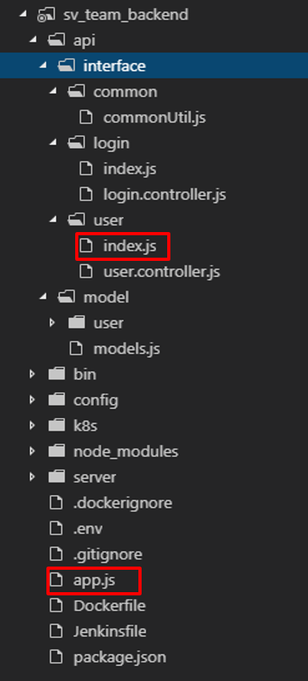  
  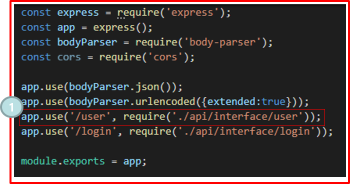  
    

Front에서 backend를 호출하게 되면 `app.js`를 통해 각 controller를 찾아가 동작을 수행하게 된다.   

그림 1번은 `localhost:8080/user`라는 주소로 요청이 들어올경우 동작한다.  
호출이 일어나면 `./api/interface/user`의 폴더를 찾아가 `index.js`파일을 가장 먼저 찾는다.  
`index.js` 파일에에 정의 된 호출 주소와 방식(get,post,put,delete)에 따라 해당하는 컨트롤러를 찾아간다.  

예시)  
`localhost:8080/user` (post) 방식으로 호출 할 경우 `controller.create`를 호출  
`localhost:8080/user/dupleCheck/3` (get) 방식으로 호출 할 경우 `controller.dupleCheck`를 호출  

 

API interface to controller
---------------------------------

  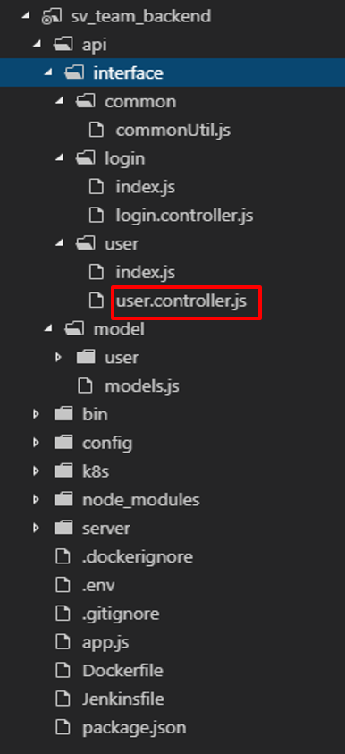  
  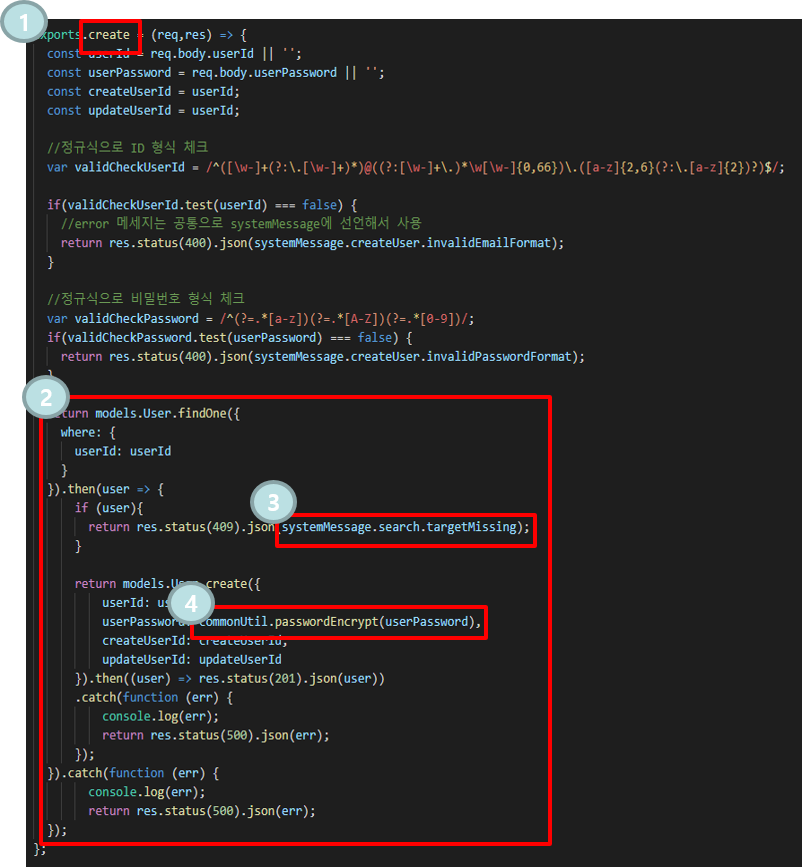  

Index에서 `controller.create`를 호출 할 경우 1번 그림에 해당하는 함수가 호출된다.  

2번 그림은 maria db와 연결하여 user정보를 가져오는 부분이다.  
미리 선언된 model을 통해 db와 통신하여 user table에서 원하는 정보를 조회해온다.  
통신시 발생하는 에러 메시지나 성공메세지는 3번 그림과 같이 공통으로 선언하여 처리한다.  

공통으로 사용되는 함수는 4번 그림과 같이 commonUtil에 작성하여 불러 쓴다.  

 

API interface to model
---------------------------------

  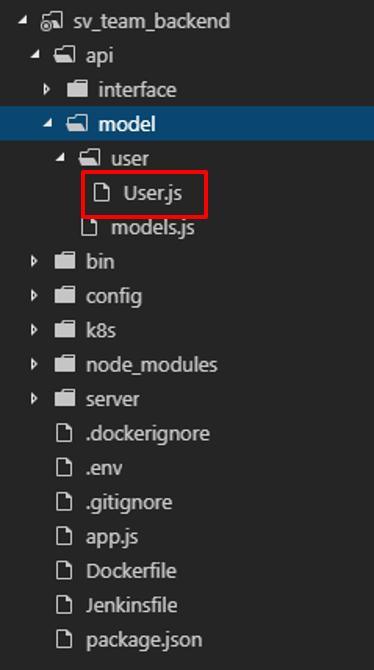  
  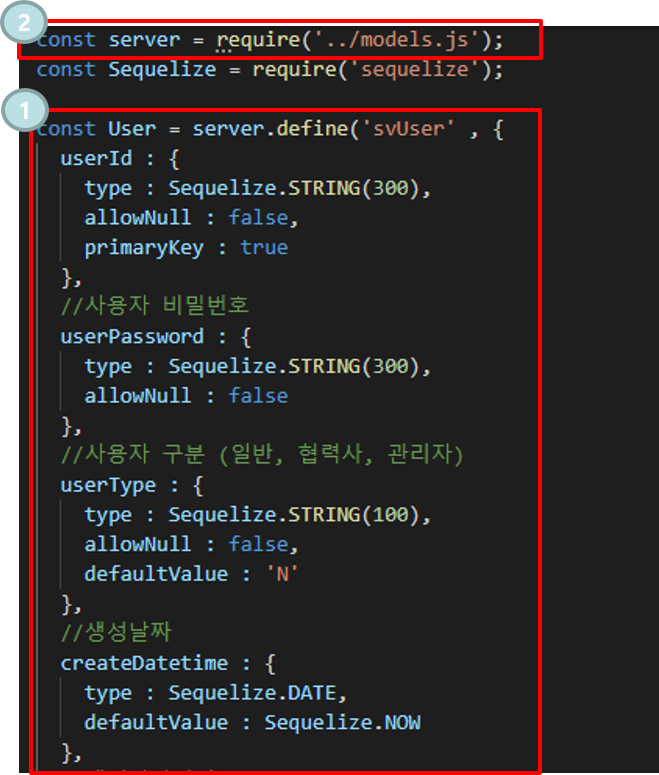  

User라는 maria db의 테이블을 model로 정의한 모습이다.  
다른 테이블도 이처럼 model로 테이블을 정의하여 maria db와 데이터를 주고 받는다.  

Db와 연결된 상태의 sequelize 객체를 import하여 model을 정의.  

 

API CommonUtil
---------------------------------

  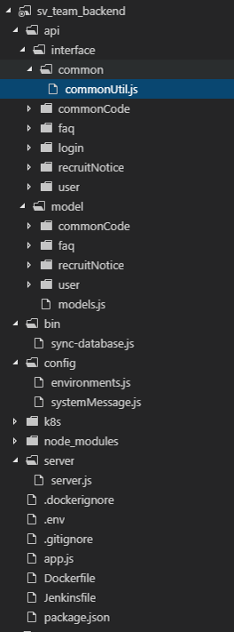  
  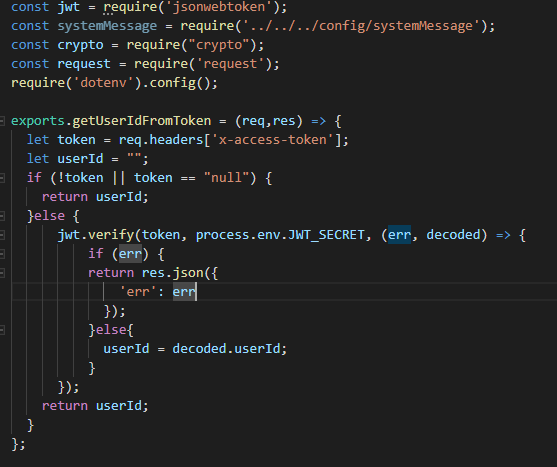  

공통함수는 commonUtil.js 파일에 선언해서 사용한다  

 

API CommonCode
---------------------------------

  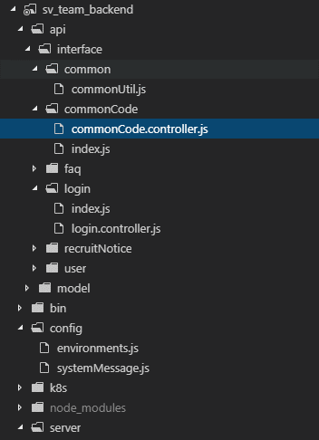  
  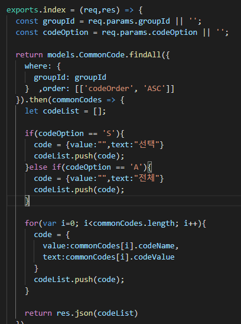  

공통코드를 사용하는 기능(셀렉트박스)들은 그림과 같이 commonCode에 정의하여 데이터를 가져 올 수 있도록 구성.  

이때 셀렉트박스의 처음 옵션은 화면에서 parameter를 넘겨주면 거기에 맞게 customizing하여 사용 할 수 있다.  
현재는 S를 받으면 '선택'을, A를 받으면 '전체'를 데이터 처음에 붙여서 넘겨주고 있다.  

 

토큰인증
---------------------------------
`토큰발급`

  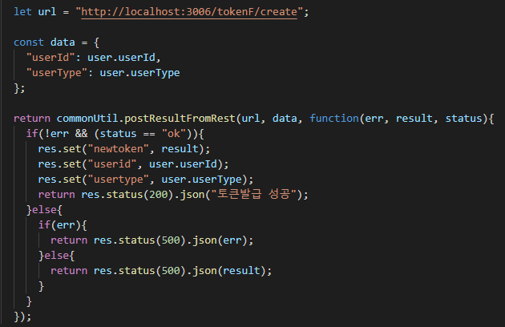  

Login시 위의 그림처럼 토큰서버에 토큰 발급을 요청하여 새로운 토큰을 발급하고 화면에 넘겨주면 해당 토큰을 통해 인증과 로그인 상태유지를 할 수 잇다.  

 
 

`토큰갱신`

    

화면에서 backend 서버에 api 요청을 할 경우 위의 그림처럼 토큰서버에 토큰 refresh를 요청 한 후 새롭게 발급된 토큰을 화면에 넘겨준다. 해당 동작은 로그인이 필요한 화면의 기능일 경우에 수행된다.  

 
 

`index에서의 refresh 함수 `

  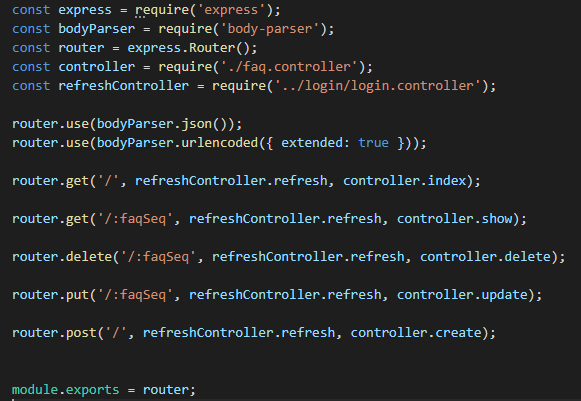  

위의 그림은 api 호출이 들어왔을때, 해당 함수를 실행하기 전 token refresh를 수행하여 token을 갱신해주는 모습이다.
refresh 함수를 보면 마지막에 next()가 선언이 되어있기때문에 위의 그림에서 `,`를 통해 연결을 해주면 refresh 로직이 수행 된 후 기존의 로직을 수행한다.

 
 

`토큰삭제`

    

Logout시 위의 그림처럼 토큰서버에 토큰 삭제를 요청하여 로그아웃을 진행한다.  

 
 

`토큰 공통함수(발급,삭제)`

  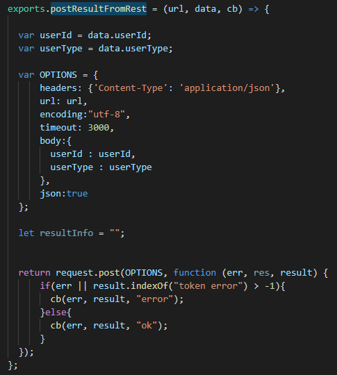  

토큰 발급과 토큰 삭제시 토큰서버를 호출하는 공통함수이다. 위의 1번과 3번 동작수행시 해당 함수를 호출한다.  

 
 

`토큰 공통함수(갱신)`

  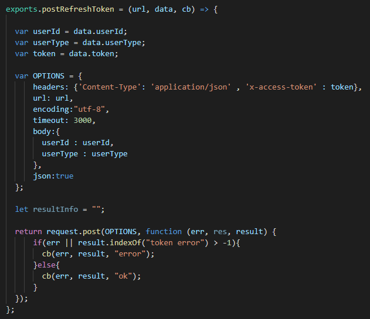  

토큰 갱신시 토큰서버를 호출하는 공통함수이다. 위의 2번 동작수행시 해당함수를 호출한다.  

